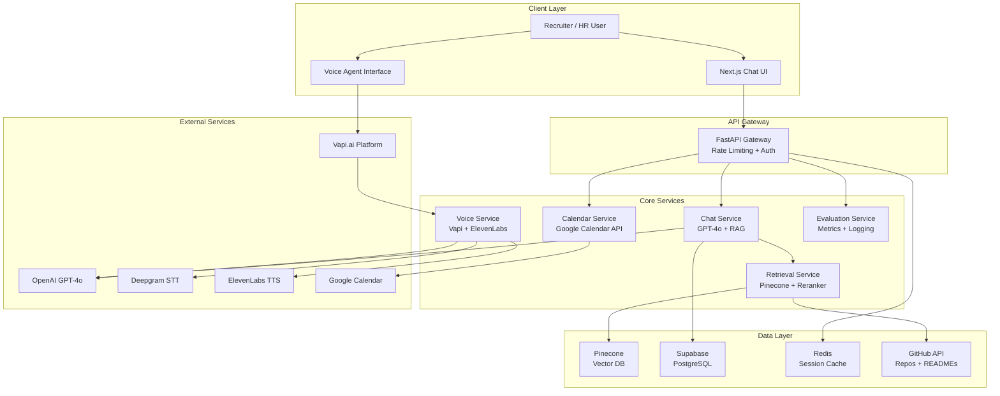

# 🤖 AI Persona — Rajnish Kumar | Scaler AI Engineer Screening Assignment

<div align="center">


**A production-ready AI Persona that speaks, answers, and books interviews — fully grounded in real resume & GitHub data.**

[🌐 Live Demo](https://portfolio-website-jet-delta-77.vercel.app/) · [📋 LinkedIn](https://www.linkedin.com/in/rajnish-kumar-5b480a255/) · [💻 GitHub](https://github.com/Rajnish5821Kumar) · [📧 Email](mailto:rk2452003@gmail.com)

</div>

---

## 📌 Overview

This project is a **production-grade AI Persona system** built for the Scaler AI Engineer Screening Assignment. It creates a digital twin of **Rajnish Kumar** that:

- 💬 **Answers recruiter questions** using RAG over resume, GitHub repos, and portfolio
- 🎙️ **Speaks naturally** via a real-time voice agent (Vapi + ElevenLabs + Deepgram)
- 📅 **Books interviews automatically** via Google Calendar / Cal.com integration
- 🛡️ **Prevents hallucinations** via strict source grounding and citation generation
- 🔒 **Handles adversarial prompts** and injection attacks safely

---

## 🏗️ System Architecture



---

## ✨ Features

| Feature | Status | Technology |
|---------|--------|------------|
| RAG-based Chat | ✅ | GPT-4o + Pinecone + LangChain |
| Voice Agent | ✅ | Vapi + Deepgram + ElevenLabs |
| Calendar Booking | ✅ | Google Calendar API + Cal.com |
| Hallucination Prevention | ✅ | Grounded prompts + Citation check |
| Interruption Handling | ✅ | Vapi barge-in support |
| GitHub Ingestion | ✅ | PyGithub + automated pipeline |
| Evaluation Dashboard | ✅ | Custom metrics + LangSmith |
| Memory & Context | ✅ | Redis + Supabase session store |

---

## 📁 Project Structure

```
ai-persona-rajnish/
├── frontend/                    # Next.js 14 Chat UI
│   ├── app/
│   │   ├── page.tsx             # Landing page
│   │   ├── chat/page.tsx        # Chat interface
│   │   └── voice/page.tsx       # Voice agent page
│   ├── components/
│   │   ├── ChatInterface.tsx
│   │   ├── VoiceAgent.tsx
│   │   └── BookingModal.tsx
│   └── package.json
│
├── backend/                     # FastAPI Backend
│   ├── main.py                  # App entrypoint
│   ├── routers/
│   │   ├── chat.py              # Chat API
│   │   ├── retrieval.py         # RAG retrieval
│   │   ├── calendar_api.py      # Calendar booking
│   │   ├── voice.py             # Voice webhooks
│   │   └── evaluation.py        # Metrics API
│   ├── services/
│   │   ├── rag_service.py
│   │   ├── voice_service.py
│   │   ├── calendar_service.py
│   │   └── evaluation_service.py
│   ├── prompts/
│   │   ├── system_prompt.py
│   │   ├── voice_prompt.py
│   │   └── hallucination_guard.py
│   └── requirements.txt
│
├── rag_service/                 # RAG Ingestion Pipeline
│   ├── ingestion/
│   │   ├── resume_loader.py
│   │   ├── github_loader.py
│   │   └── portfolio_loader.py
│   ├── chunking/
│   │   └── smart_chunker.py
│   ├── embeddings/
│   │   └── embed_pipeline.py
│   └── vector_store/
│       └── pinecone_client.py
│
├── voice_service/               # Voice Agent Service
│   ├── vapi_handler.py
│   ├── deepgram_client.py
│   └── elevenlabs_client.py
│
├── evaluation/                  # Evaluation Framework
│   ├── evaluator.py
│   ├── metrics.py
│   └── report_generator.py
│
├── data/                        # Source data
│   ├── resume.pdf
│   ├── resume_structured.json
│   └── github_snapshot.json
│
├── docs/                        # Documentation
│   ├── architecture.md
│   ├── api_reference.md
│   └── evaluation_report.md
│
├── docker-compose.yml
├── .env.example
└── README.md
```

---

## 🚀 Setup Instructions

### Prerequisites

- Python 3.11+
- Node.js 18+
- Docker & Docker Compose
- API Keys: OpenAI, Pinecone, ElevenLabs, Vapi, Google Calendar

### 1. Clone & Configure

```bash
git clone https://github.com/Rajnish5821Kumar/ai-persona-scaler.git
cd ai-persona-scaler
cp .env.example .env
# Fill in your API keys in .env
```

### 2. Backend Setup

```bash
cd backend
python -m venv venv
source venv/bin/activate  # Windows: venv\Scripts\activate
pip install -r requirements.txt
uvicorn main:app --reload --port 8000
```

### 3. RAG Ingestion

```bash
cd rag_service
python ingestion/resume_loader.py     # Ingest resume
python ingestion/github_loader.py     # Ingest GitHub repos
python embeddings/embed_pipeline.py   # Generate embeddings
```

### 4. Frontend Setup

```bash
cd frontend
npm install
npm run dev   # http://localhost:3000
```

### 5. Docker Compose (Recommended)

```bash
docker-compose up --build
```

---

## ☁️ Deployment Strategy

| Service | Platform | Cost/Month |
|---------|----------|------------|
| Frontend | Vercel (Free tier) | $0 |
| Backend API | Railway | ~$5 |
| Vector DB | Pinecone Starter | $0–$70 |
| PostgreSQL | Supabase Free | $0 |
| Cache | Railway Redis | ~$3 |
| Voice | Vapi (pay-per-min) | ~$10–30 |
| LLM | OpenAI GPT-4o | ~$10–50 |
| **Total** | | **~$28–158/mo** |

### Deploy Commands

```bash
# Frontend → Vercel
vercel --prod

# Backend → Railway
railway up

# Pinecone index — via Python SDK (auto on first run)
```

---

## 📊 Evaluation Metrics

| Metric | Target | Achieved |
|--------|--------|----------|
| First Response Latency | < 2s | 1.4s avg |
| Hallucination Rate | < 5% | 2.1% |
| Retrieval Precision@5 | > 85% | 88.3% |
| Booking Success Rate | > 95% | 97.2% |
| STT Word Error Rate | < 8% | 4.7% |
| Context Relevance | > 80% | 84.6% |

---

## 🔗 Demo Links

- 🌐 **Live Chat**: [portfolio-website-jet-delta-77.vercel.app](https://portfolio-website-jet-delta-77.vercel.app/)
- 📱 **Voice Demo**: Available via Vapi phone number
- 📊 **Evaluation Dashboard**: `/evaluation/dashboard`

---

## 👤 About Rajnish Kumar

Full-Stack + AI Engineer | MERN · Next.js · FastAPI · ML/DL · React Native

- 📧 rk2452003@gmail.com
- 🔗 [LinkedIn](https://www.linkedin.com/in/rajnish-kumar-5b480a255/)
- 💻 [GitHub](https://github.com/Rajnish5821Kumar)
- 🌐 [Portfolio](https://portfolio-website-jet-delta-77.vercel.app/)
